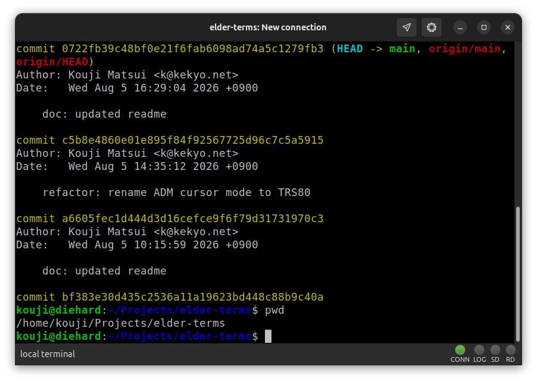
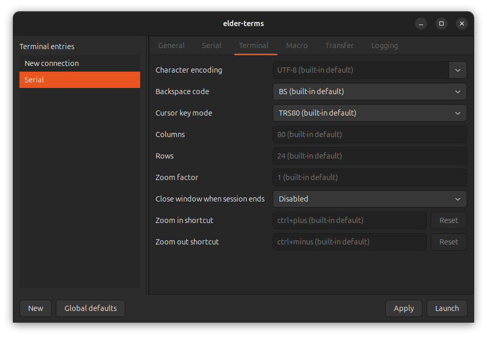
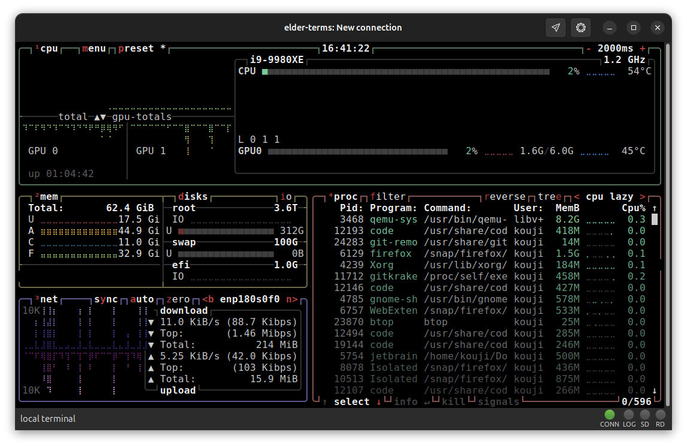
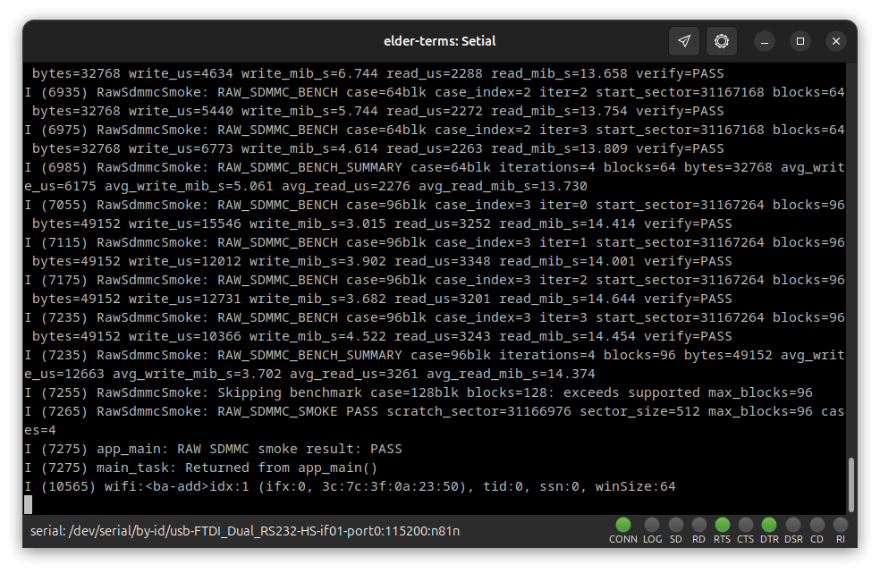
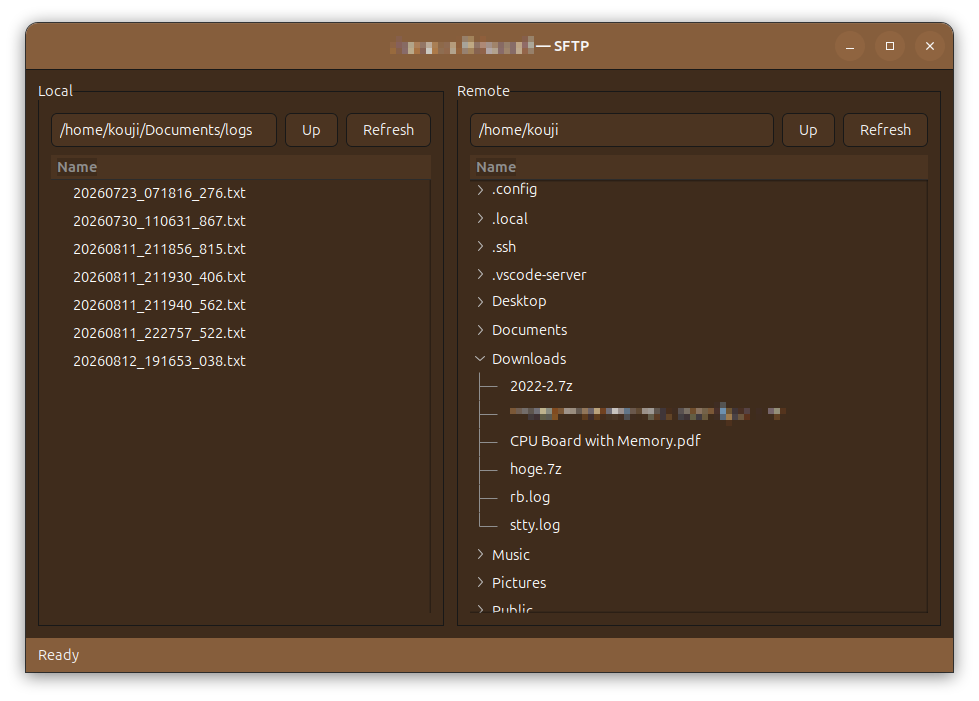
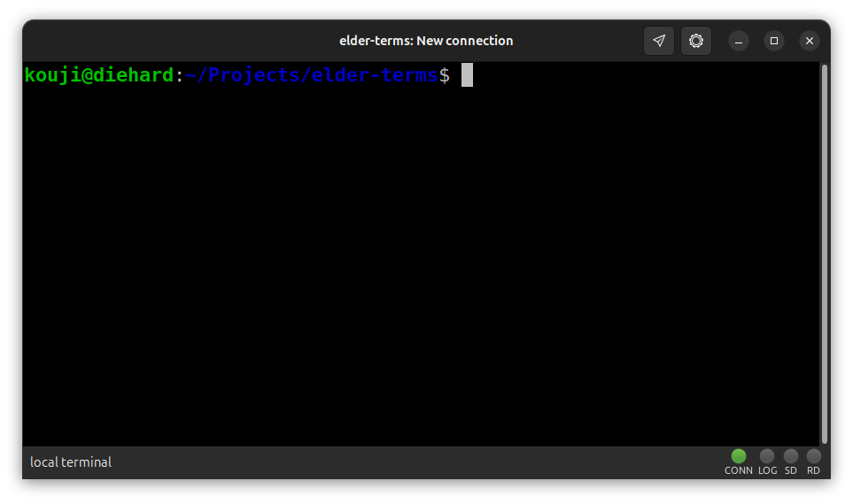
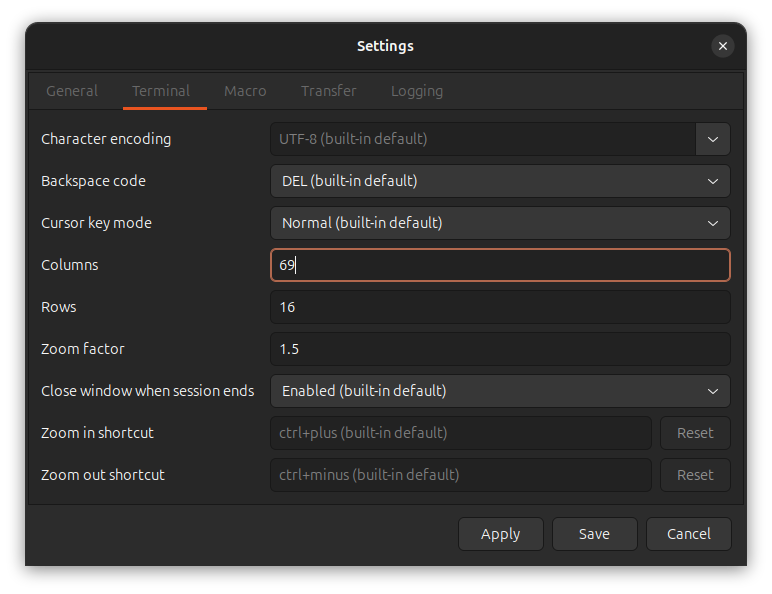
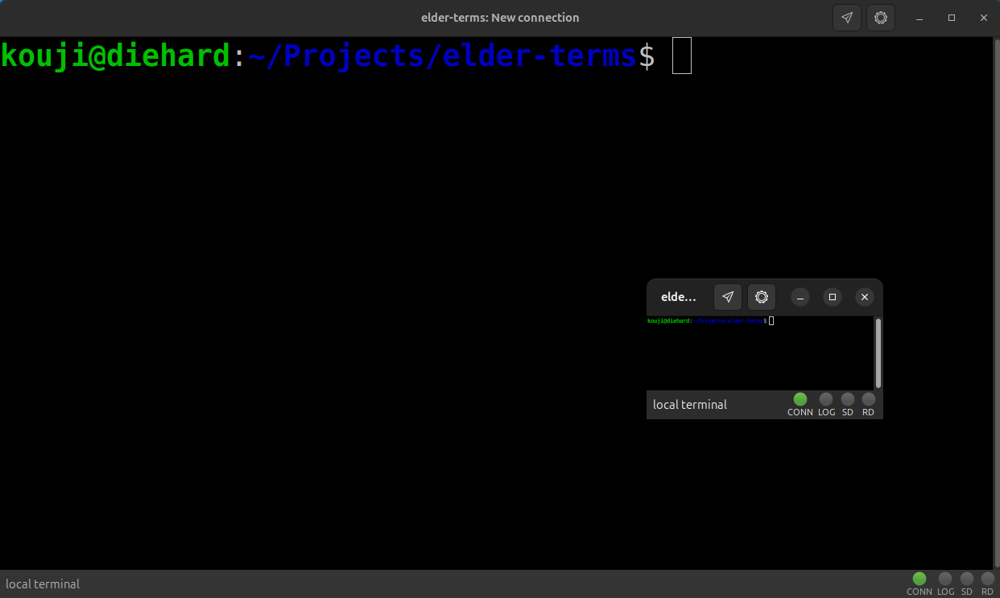
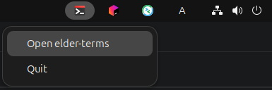

# elder-terms

'90s, come back in this time. This is all we need.


[](https://www.repostatus.org/#active)
[](https://opensource.org/licenses/MIT)

----

[(Japanese language is here/日本語はこちら)](./README_ja.md)

> Please note that this English version of the document was machine-translated and then partially edited, so it may contain inaccuracies.
> We welcome pull requests to correct any errors in the text.

## What Is This?

elder-terms is a GTK terminal for serial, TELNET, local shell, SSH, and SFTP
connections, inspired by personal computing in the 1990s.

### Basic Terminal



### Terminal Launcher



### Complex Display



### Serial Device



### Custom Exterior Colors


### SFTP



## Features

- Provides a simple, no-frills terminal with everything you need, using Linux
  GTK/`libvte`.
- Supports local terminals, SSH, and SFTP as well as serial and TELNET
  connections, bringing that familiar terminal experience into the present.
- Lets you manage multiple connections and launch terminals from the launcher.
- Stores all connection settings in INI files, which you can freely edit with
  any text editor.
- Lets you configure BS/DEL, cursor key conversion, Enter/Return codes, and
  character encoding conversion.
- Remembers the terminal's rows and columns for each connection.
- Lets you explicitly specify the terminal type, such as `xterm` or
  `xterm-256color`, for TELNET and SSH.
- Supports X/Y/ZMODEM file transfers for all connection types except local
  terminals. Automatic transfers can be enabled for ZMODEM.
- Transfers files to and from the host of an SSH connection over SFTP.
- Supports pasting text and sending text files. You can specify the send rate
  and newline handling to avoid overflowing the host's buffer or using
  incompatible newline codes.
- Shows indicators at the bottom of the terminal so you can reminisce about
  analog modems.
- Uses either the built-in beep or a custom WAV/Ogg Vorbis sound for BEL.
- Changes the font size with keyboard shortcuts or the mouse wheel.
- Customizes the window exterior colors and terminal background for each
  connection.
- Opens a specified connection with a single hotkey (the XDG Global Shortcuts
  portal is required on Wayland). Start by opening your local terminal with a
  hotkey. It may only be a matter of time before everything is replaced by
  elder-terms.
- Starts the launcher automatically and can keep it running in the system tray.
- Monitors received text with regular expressions and defines rules that
  automatically send text or run a specified command.
- Opens OSC 8 hyperlinks by holding `Ctrl` and left-clicking, passing paths and
  line numbers extracted by regular expressions to any command.
- Records logs to files and organizes them into directories by connection and
  date and time.
- Supports multilingual display (English, Arabic, Spanish, French, Hindi,
  Japanese, Korean, Portuguese, Russian, and Simplified Chinese).

## Environment

- Linux GTK3 / DBus (Ubuntu/Debian preferred)

---

## Installation

Download a prebuilt package (deb format) from the
[releases](https://github.com/kekyo/elder-terms/releases/) and install it:

```bash
sudo apt install ./elder-terms-*.deb
```

Then start elder-terms:

```bash
elder-terms
```

---

## Basic Usage

First, create a connection entry for a local terminal. This is a terminal that
starts a shell such as `bash`, much like the terminal you normally use.


Creating one is easy. Click the "New" button at the bottom of the launcher,
change the name from "New connection" to whatever you like, and click "Save".
You now have an entry that starts a local terminal. Double-click the entry in
the launcher's list to open it. There it is:



Click the gear icon at the top of the terminal to change its settings. Clicking
"Apply" applies the changes only to the currently running terminal. Clicking
"Save" remembers the settings and uses them the next time the terminal starts.



Try changing different settings with the "Apply" button. If something goes
wrong, simply close the terminal window to discard the changes.

Most settings are self-explanatory once you try them, but a few need more
detail. Those settings are described in the following sections.

It is also useful to remember that `Ctrl`+`=` increases the font size and
`Ctrl`+`-` decreases it. You can do the same with the mouse wheel while holding
`Ctrl`.



Terminal window placement is left to your window manager or Wayland
compositor. Use bindings such as the `Super` key according to your window
system environment.

Today, IoT development often involves debugging and collecting logs from
serial devices such as Arduino boards. elder-terms is exceptionally capable in
such environments.

And yes, analog modems have not been forgotten. The indicators at the bottom
of the terminal will satisfy that nostalgia:


Think the blinking looks suspiciously regular? Of course it does. It is an
homage to the [SONY NEWS workstation](https://en.wikipedia.org/wiki/Sony_NEWS).

---

## Configuration Structure

elder-terms has the following three kinds of configuration values. Items later
in the list take precedence.

1. Built-in defaults: Defaults provided by elder-terms itself. They are
   determined by the connection type and other factors.
2. Settings saved in INI files: Connection values in `global.ini`, edited with
   "Connection defaults", override the built-in defaults, and each
   connection's INI file overrides `global.ini`. Application-wide settings are
   edited separately with "Application settings" and are also stored in
   `global.ini`. These settings are preserved for the next launch.
3. Launch-session settings: If you launch a connection with unsaved changes in
   the launcher, those changes are passed to the connection window as a
   temporary launch profile. Changes made with "Apply" in the settings dialog
   after launch also affect only the current session. These settings are not
   recorded in an INI file unless you click "Save", and they are lost when the
   session ends.

In the settings dialog, inherited values show their source as
`(built-in default)` or `(global default)`. Text fields show defaults as faint
placeholder text, while selection fields append the source to the default
option.

Ordinary values without a source in parentheses were explicitly set in the
connection's INI file or in the current launch session. The displayed value
alone does not distinguish between the two. "Save" records explicit values in
the connection's INI file, while "Apply" affects only the current session.

Clearing a text field or selecting the default item in a selection field
removes the explicit value, causing the setting to inherit the global or
built-in default again.

## Local Startup Process

For a Local connection, "Startup command" on the Local tab selects the process
that `elder-terms-vte` starts in the terminal. The setting takes effect the next
time the connection is opened and is read-only in a running terminal.

When this field is empty, it inherits the global or built-in default. The
built-in default starts the user's shell specified by `SHELL`, with no
additional arguments. If `SHELL` is unset or empty, `/bin/sh` is used.

The value is split into an executable and arguments using shell-style quoting,
but the process is started directly without a shell. Environment-variable
expansion, globbing, redirection, and pipelines are therefore not performed.
Start a shell explicitly when those features are required, for example:

```ini
[local]
command_line=/bin/sh -lc 'exec tmux new-session -A -s elder-terms'
```

The same `[local]` setting can be saved as a global default or overridden for
an individual connection. Clearing "Startup command" restores inheritance.

## Selecting a Serial Device

For a serial connection, "Device identification" lets you choose one of three
ways to identify the device:

- Stable device identity: Uses a link created under `/dev/serial/by-id`. This
  tracks the same USB serial device even when it is moved to another USB port,
  so you should normally use this built-in default.
- Physical USB port: Uses a link created under `/dev/serial/by-path`. Use this
  when you always want to connect to the device plugged into the same physical
  port rather than to a particular USB serial device.
- Device path: Uses the current device node, such as `/dev/ttyUSB0` or
  `/dev/ttyACM0`. Its node number may change after the device is unplugged and
  reconnected.

"Device" is not a field for directly entering a path. It lists the devices
currently available under the selected identification method. The list updates
automatically when devices are plugged in or unplugged. "Stable ID", "USB
serial number", and "Current device node" are also shown for the selected
device.

If the device is removed while connected, elder-terms retains the selected
identity and reconnects when the same target reappears. "Stable device
identity" also stores the USB serial number as supplementary information. This
allows elder-terms to reconnect to the same device when it can uniquely
identify one, even if the `/dev/serial/by-id` link name changes. If multiple
candidates have the same USB serial number, it waits for a connection instead
of selecting the wrong device.

The values are stored in the INI file as follows. `device_match_mode` is one of
`path`, `by-id`, or `by-path`, and defaults to `by-id` when omitted.
`device_usb_serial` is supplementary information that is saved when the
settings screen can obtain it.

```ini
[serial]
device_match_mode=by-id
device=/dev/serial/by-id/usb-Example_Serial_Device_1234-if00
device_usb_serial=1234
```

If a legacy INI file without `device_match_mode` stores a `device` such as
`/dev/ttyUSB0`, that path continues to be used. When selecting the device again
in the settings screen, choose the identification method above that suits your
use case.

## Monitoring Serial Connections

"Connection monitoring signal" detects a session disconnection when DCD, CTS,
or DSR changes from high to low. Select "Ignore (do not monitor)" if your USB
serial adapter has no usable modem-line signal, or if its driver does not
support polling modem lines and reports "Invalid argument".

With "Ignore (do not monitor)", elder-terms does not read modem-line state, and
that state cannot trigger "Close window when session ends". The serial session
remains available for sending and receiving. Removing the device itself, or a
read/write error, is still treated as an actual disconnection as before.

The setting is stored in the INI file as follows:

```ini
[serial]
carrier_detect=ignore
```

## Character Encoding and Special Key Settings

"Character encoding" converts bytes received from the remote host to UTF-8 for
display, and converts entered text to the remote host's character encoding.
The default for every connection is `UTF-8`.

"Backspace code" selects the control code sent when you press Backspace.
"Auto" leaves the choice to `libvte`, "BS" sends ASCII BS (`0x08`), and "DEL"
sends ASCII DEL (`0x7f`). Change this setting if pressing Backspace on the
remote host does not delete a character or displays something such as `^H`.
The Delete key uses `libvte`'s automatic binding regardless of this setting.

"Normal" under "Cursor key mode" sends the normal escape sequences generated
by `libvte` unchanged. "TRS80" converts them to the one-byte control codes used
by the TRS-80 Model 100/200, IBM PC GW-BASIC/Quick BASIC, NEC PC-9800 series,
and MSX: up is `0x1e`, down is `0x1f`, right is `0x1c`, and left is `0x1d`.
Use this mode when the remote host expects TRS-80-style cursor keys.

"Enter/Return code" selects the code sent when an unmodified Return key or
numpad Enter confirms a normal newline. "CR" sends `0x0d`, "LF" sends `0x0a`,
and "CRLF" sends `0x0d 0x0a`. For keyboard input, "Auto" uses `libvte`'s choice
unchanged. It does not replace Return/Enter modified by `Shift`, `Ctrl`, `Alt`,
`Super`, or similar keys, nor dedicated sequences generated in application
keypad mode.

The built-in defaults for each connection type are as follows:

| Connection type | Character encoding | Backspace code | Cursor key mode | Enter/Return code |
| :--- | :--- | :--- | :--- | :--- |
| Local terminal | UTF-8 | `Auto` | `Normal` | `Auto` |
| SSH | UTF-8 | `Auto` | `Normal` | `Auto` |
| TELNET | UTF-8 | `Auto` | `Normal` | `Auto` |
| Serial | UTF-8 | `BS` | `TRS80` | `CR` |

When editing the INI file directly, set `return_code` to one of `auto`, `cr`,
`lf`, or `crlf`.

```ini
[terminal]
return_code=crlf
```

## Newlines When Sending and Pasting Text

"Follow Enter/Return code for text send" applies to sending text files, macro
output, and all text pasted from the clipboard or primary selection through a
keyboard shortcut or the context menu. The built-in default is enabled.

When enabled, CRLF, a lone CR, and a lone LF in the input are first read as a
single logical newline, and each newline is then sent according to the
"Enter/Return code" setting. With "Auto", text sending uses CR. When a file is
read in multiple chunks, this processing also treats a CRLF split across a
chunk boundary as one newline.

When disabled, the original sequence of CR, LF, and CRLF in the input is not
changed. For a TELNET connection, the CR framing and IAC escaping required by
TELNET NVT are still applied afterward.

Pasting does not fall back to `libvte` paste handling or Bracketed Paste. It
uses the same send-rate control, character encoding conversion, and newline
processing as sending a text file. Specify this setting in the INI file as
follows:

```ini
[transfer]
text_send_follow_return_code=true
```

## Sending BREAK

When a key combination is assigned to "Send BREAK shortcut", one BREAK is sent
for each physical key press. Automatic repeats caused by holding the key are
suppressed. Leaving the field blank disables the shortcut. The zoom-in,
zoom-out, and BREAK shortcuts cannot use the same key combination.

You can perform the same action by right-clicking the terminal and selecting
"Send BREAK". The menu item is disabled while disconnected, during a transfer,
and in a local terminal. Progress and the result appear in the status bar, and
the SD indicator lights while BREAK is sent.

Each connection type sends the following:

| Connection type | BREAK behavior |
| :--- | :--- |
| Local terminal | Not supported |
| TELNET | Sends `IAC BRK` |
| Serial | Asserts the line's BREAK state for 500 milliseconds, then clears it |
| SSH | Sends an SSH BREAK request for 500 milliseconds |

When editing the INI file directly, specify the shortcut as follows:

```ini
[terminal]
send_break_key=F12
```

## Notes on Character Encodings

Character encodings accept names defined by iconv, but be aware that several
definitions can have similar yet different names.

For example, in Japanese environments, Shift JIS is commonly used for BBS
serial communication and has the obvious iconv name `SHIFT_JIS`. In practice,
however, the extended `CP932` conventionally used by the NEC PC-9800 series is
usually the better choice.

If you use a different encoding, receiving extended or altered characters can
produce garbled text.

## Configuring the Scrollback Buffer

"Scrollback lines" on the "Terminal" tab sets the normal-screen history kept
by VTE, from 1,000 to 100,000 lines. The built-in default is 10,000 lines.

When editing the INI file directly, specify the value as follows:

```ini
[terminal]
scrollback_lines=20000
```

## Configuring the BEL Sound

"BEL sound" on the "Terminal" tab selects the sound played when the terminal
receives BEL. The built-in `default` value keeps VTE's existing simple beep.

For a custom sound, enter the absolute path of an existing file or use the
"Select file" button to choose it. Supported formats are Ogg Vorbis (`.oga`,
with the legacy `.ogg` extension also accepted) and WAV (PCM).

```ini
[terminal]
bell_sound=/home/user/.local/share/sounds/terminal-bell.oga
```

Connection settings can inherit the global default. If the global default uses
a custom sound, set `bell_sound=default` on one connection to restore the
built-in beep for that connection. If libcanberra cannot start playback,
elder-terms falls back to the built-in beep until the settings are applied
again.

## Configuring Font Families

Scroll down on the "Terminal" tab to specify primary and secondary font
families. Each drop-down lets you inherit the global or built-in default,
explicitly use the built-in default, or select a custom font. Confirming a font
in the font chooser automatically switches the drop-down to the custom font.

The built-in defaults are `Noto Sans Mono` for the primary font and `Monospace`
for the secondary font.

The primary font is used for normal rendering. The secondary font is used as a
fallback for characters missing from the primary font. For example, if you
choose a Latin font as the primary font and a Japanese font as the secondary
font, kanji, hiragana, and similar characters are rendered with the secondary
font.

These settings save only the font families; they do not include font size,
weight, or style. Font size continues to follow "Zoom factor", `Ctrl`+`=`,
`Ctrl`+`-`, or the mouse wheel while holding `Ctrl`.

When editing the INI file directly, specify the values as follows:

```ini
[terminal]
font_primary_family=DejaVu Sans Mono
font_fallback_family=Noto Sans Mono CJK JP
```

To explicitly use a built-in default instead of inheriting the global default,
set the corresponding value to `default`.

## Configuring Hotkeys

Hotkeys work only while the elder-terms launcher is running. In environments
with a system tray, you can keep the launcher in the tray by opening the
application menu, selecting "Application settings", and setting "Startup mode"
to "System tray only" or "System tray and main window".



The deb package and Meson installation install an XDG autostart entry that
starts elder-terms when you log in to the desktop. Whether autostart shows the
launcher and keeps it in the system tray follows "Startup mode" under
"Application settings", so hotkeys are available immediately after login.

To disable autostart, use your desktop environment's startup-application
settings. You can also override the system-wide autostart entry by placing a
file with the same name, `net.kekyo.elder-terms.desktop`, in your
`~/.config/autostart` directory and setting `Hidden=true`. Simply building the
source tree does not install the autostart entry.

Assigning a key combination to "Open connection shortcut" for a connection
lets you open it directly with that hotkey even while the launcher is hidden.
"Open application shortcut" under "Application settings" shows the launcher;
its default is `Ctrl+Alt+T`.

### Hotkey Limitations on Wayland

Wayland sessions require an implementation of the XDG Global Shortcuts portal
to register hotkeys. Because [Global Shortcuts has been officially supported
since GNOME 48](https://release.gnome.org/48/developers/#global-shortcuts),
hotkeys do not work in Wayland sessions on GNOME 47 or earlier. Distributions
using the standard GNOME desktop are supported starting with
[Ubuntu 25.04](https://discourse.ubuntu.com/t/ubuntu-25-04-plucky-puffin-released/59303)
and [Debian 13](https://www.debian.org/News/2025/20250809), which adopted GNOME
48 or later.

In other words, they are unavailable in GNOME Wayland environments on Ubuntu
24.10 or earlier and Debian 12 or earlier.

X11 sessions are not subject to this limitation. Availability in non-GNOME
Wayland environments depends on whether the desktop environment supports the
Global Shortcuts portal.

## Configuring the Terminal Type

The terminal type is a name that tells the remote host which kind of terminal
elder-terms emulates. This value is automatically reported during terminal-type
negotiation for TELNET and when allocating a pseudo-terminal for SSH.

Shells and applications that use `curses` on the remote host consult the
corresponding `terminfo` entry to select control sequences for colors, cursor
movement, function keys, and other features. You can normally leave the
default unchanged. If the remote host does not support that terminal type,
specify a value installed on the host, such as `xterm`.

The normal default for TELNET and SSH is `xterm-256color`. However, if you set a
"Content background" color without explicitly setting the terminal type, the
default automatically changes to `xterm`. This is because the background color
may not render correctly with `xterm-256color`. If you explicitly set the
terminal type, that value takes precedence even when the background color is
changed.

## Configuring the Display Language

"Display language" under "Application settings" lets you select the system
default, English, Arabic, Spanish, French, Hindi, Japanese, Korean, Portuguese,
Russian, or Simplified Chinese.

The display language is loaded when elder-terms starts, so you must restart
elder-terms after saving a change. Select "Restart now" in the dialog shown
when you save, or restart it manually later. Terminal and SFTP windows that are
already open do not change language immediately either.

## Checking the Running Version

Open the application menu in either the launcher or a terminal window and
select "About elder-terms". Both entries open the same launcher-owned dialog,
whose "About" page shows the version embedded in the running build or deb
package.

> Note: The elder-terms project owner is a native Japanese speaker who
> understands Japanese and English but cannot read any of the other languages.
> Consequently, the multilingual text included in elder-terms relies entirely
> on machine translation. If you find an undesirable translation, please send
> a pull request.

## Configuring Logging

Enabling "Enable logging" records content received from the remote host in a
file. "Log directory" is the base destination directory and defaults to
`${documents}/logs/`. "File name format" is a relative path under that
directory and defaults to `${YYYYMMDD}_${hhmmss}_${fff}.txt`.

Both fields support the following placeholders:

- `${documents}`, `${downloads}`, `${home}`: The user's Documents, Downloads,
  and home directories, respectively
- `${name}`: The connection name
- `YYYY`, `MM`, `DD`: The year, month, and day in the local time when logging
  started
- `hh`, `mm`, `ss`, `fff`: The hour, minute, second, and millisecond at the same
  time

Date and time components can be combined in one placeholder, such as
`${YYYYMMDD}` or `${YYYY-MM-DD}`. Write a literal `$` as `$$`. "File name
format" may contain `/`, and the required directories are created
automatically. For example, setting "Log directory" to
`${documents}/elder-terms` and "File name format" to
`${name}/${YYYY}/${MM}/${YYYYMMDD}_${hhmmss}.txt` separates logs by connection,
year, and month.

"Log content" selects the storage format and character encoding. "Raw bytes
(before character conversion)" stores bytes received from the remote host
without conversion, preserving the encoding configured for the connection.
"UTF-8 text (after character conversion)" stores the text as UTF-8 after its
character encoding has been converted for display.

## Configuring Macros

Macros (automatic macros) monitor text received from the remote host with
regular expressions. When a match is found, they either send text to the host
or run a specified command. They are available for local terminal, TELNET,
serial, and SSH connections, but cannot be defined for SFTP connections or
Connection defaults.

In text to send, commands, and command arguments, `${0}` refers to the entire
regular-expression match, `${1}` and `${2}` refer to numbered captures, and
`${name}` refers to a named capture. Write a literal `$` as `$$`.

Macro rules are evaluated from top to bottom. Even if multiple regular
expressions match the same received line, only the first matching rule runs.
Use "Move up" and "Move down" to place higher-priority rules nearer the top.
When editing the INI file directly, the order in which `[macro.<rule-id>]`
sections appear determines their priority.

The following examples show the format used when editing a connection's INI
file directly. You can configure the same values on the "Macro" tab in the
settings dialog.

This rule automatically sends Enter when the remote host displays
`Press ENTER to continue`:

```ini
[macro.continue]
regex=^Press ENTER to continue$
send=\r\n
```

This rule extracts a token from text such as `CHALLENGE TOKEN` and responds
with `RESPONSE TOKEN` followed by a newline:

```ini
[macro.challenge]
regex=^CHALLENGE (?<token>[A-Z]+)$
send=RESPONSE ${token}\r\n
```

When a line such as `ERROR: Connection failed` is received, this rule passes
the message portion to the `logger` command and records it in the system log.
`arguments` is semicolon-delimited, and each item becomes a separate command
argument.

```ini
[macro.log-error]
regex=^ERROR: (.+)$
command=/usr/bin/logger
arguments=-t;elder-terms;${1};
```

Commands are launched directly without a shell, so shell syntax such as pipes
and redirections is not interpreted. Specify each required value as a separate
item in `arguments`.

## Configuring OSC 8 Hyperlinks

Hyperlinks displayed by a program on the remote host using OSC 8 escape
sequences can be opened with an external command by holding `Ctrl` and
left-clicking. elder-terms matches the complete raw OSC 8 target against
regular expressions and runs only the first rule that matches the entire
target.

When `global.ini` has no hyperlink configuration, built-in rules open the
following formats:

```text
vscode://file/absolute/path:line
vscode://file/absolute/path:line:column
```

These launch `code --reuse-window --goto /absolute/path:line` or
`code --reuse-window --goto /absolute/path:line:column`, respectively. URI
escapes in the path, such as `%20`, are decoded before the path is passed as a
command argument.

To change the command and arguments, add rules to the global configuration
file at `~/.config/elder-terms/global.ini`. For example, the following rule
extracts a path and line number from a custom OSC target:

```ini
[hyperlink]
enabled=true

[hyperlink.custom-editor]
regex=^editor://open(?<path>/[^:]+):(?<line>[1-9][0-9]*)$
command=my-editor
arguments=--line;${line};${path|uri-decode};
```

`[hyperlink.<rule-id>]` sections are evaluated in file order. Rule IDs may
contain letters, digits, `-`, and `_`. `regex` must match the entire OSC 8
target. `command` is a fixed executable name or path and does not expand
captures.

`arguments` is semicolon-delimited, and each item becomes a separate command
argument. Within each argument, `${0}` refers to the entire match, `${1}` and
`${2}` refer to numbered captures, and `${name}` refers to a named capture.
Adding `|uri-decode`, as in `${path|uri-decode}`, decodes URI escapes in that
capture. Write a literal `$` as `$$`.

Defining any explicit hyperlink configuration replaces the built-in VS Code
rules with the custom rules. To disable all hyperlink actions, use:

```ini
[hyperlink]
enabled=false
```

This configuration is global only. `[hyperlink]` and `[hyperlink.*]` sections
in connection settings or temporary launch profiles are ignored.

Commands are launched without a shell, with `command` and each `arguments`
item passed unchanged as a separate `argv` element. Because OSC 8 targets may
be supplied by the remote host, restrict each regular expression to only the
formats you intend to accept. Invalid rules, undefined captures, and invalid
URI escapes are not executed.

## INI File Locations

Configuration files are stored under the XDG user configuration directory. In
a typical environment where `XDG_CONFIG_HOME` is not set, their locations are:

- Global settings (application settings and connection defaults):
  `~/.config/elder-terms/global.ini`
- Connection settings:
  `~/.config/elder-terms/connections/<connection-name>.ini`

When `XDG_CONFIG_HOME` is set, its value replaces `~/.config` in the paths
above. Connection settings inherit the connection defaults in the global file,
and values changed for an individual connection take precedence over them.

---

## Building from Source

To build on Ubuntu or Debian, install a C++20-capable compiler, Meson, Ninja,
gettext, and the development packages for the libraries used by elder-terms:

```bash
sudo apt update
sudo apt install build-essential git meson ninja-build pkg-config gettext \
  libglib2.0-dev libgtk-3-dev libgdk-pixbuf-2.0-dev libcanberra-dev libx11-dev \
  libxkbcommon-dev liburing-dev libudev-dev libssh-dev libvte-2.91-dev
```

Node.js 20 or later is also required. The Node.js package provided by your
distribution may be suitable:

```bash
sudo apt install nodejs
node --version
```

If the distribution's Node.js is too old, use an
[official Node.js distribution](https://nodejs.org/en/download) or a version
manager of your choice, such as [nvm](https://github.com/nvm-sh/nvm).

> You may find it unusual to use Node.js in a GTK project. It is required
> because the GTK UI tests use
> [gestament](https://github.com/kekyo/gestament/).

When cloning the source for the first time, include the submodules to obtain
the [cardio](https://github.com/kekyo/cardio/) and
[libxyzm](https://github.com/kekyo/libxyzm/) dependencies:

```bash
git clone --recurse-submodules https://github.com/kekyo/elder-terms.git
```

If you have already cloned the repository, initialize and update its
submodules with:

```bash
git submodule update --init --recursive
```

Install the npm dependencies and build all workspaces:

```bash
npm ci
npm run build
```

Run the built launcher from the repository root with the following command.
The launcher automatically detects the terminal and SFTP executables in the
same build directory.

```bash
./.build/elder-terms/elder-terms
```

Alternatively:

```bash
npm run dev
```

To run the tests (which take a very long time because they include UI tests):

```bash
npm run test
```

## Building deb Packages

The package-building scripts combine the launcher, terminal, and SFTP
executables; dedicated shared library and UI data; translation catalogs;
desktop and XDG autostart entries; icons; documentation; and license notices
into a single `elder-terms` deb package.

The following package combinations are supported:

| Distribution | Release | Architectures |
| --- | --- | --- |
| Debian | bookworm | amd64, i386, arm64, armhf |
| Debian | trixie | amd64, i386, arm64, armhf, riscv64 |
| Ubuntu | 24.04 | amd64, arm64 |
| Ubuntu | 26.04 | amd64, arm64 |

The host requires Podman, binfmt/QEMU for non-native targets, `dpkg-deb`,
`readelf`, Node.js, and `npx`. From the repository root, first generate the
reusable prerequisite images once, then build packages for every combination:

```sh
./prereq.sh
./build_package_all.sh
```

Regenerate the images after changing the prerequisite package configuration:

```sh
./prereq.sh --force
```

Both commands support filtering with `--distro`, `--release`, `--arch`, and
`--jobs`. For example, to build only for Ubuntu 24.04 amd64, matching the host:

```sh
./prereq.sh \
  --distro ubuntu --release 24.04 --arch amd64
./build_package.sh \
  --target deb --distro ubuntu --release 24.04 --arch amd64
```

Architecture aliases such as `amd64`, `i386`, `armhf`, and `aarch64` are also
accepted. `noble` and `resolute` are treated as Ubuntu 24.04 and 26.04,
respectively. Pass `--debug` to preserve debugging information. If `--version`
is omitted, the version is determined by
`npx screw-up format -e '{version}' -f`.

Artifacts are stored in `artifacts/deb/`, with names such as
`elder-terms-VERSION-ubuntu-24.04-amd64.deb`. Each package is inspected for its
control metadata, runtime dependencies, installed layout, symbolic-link
targets, and ELF architecture. It is then installed in a fresh container for
the same distribution and architecture to verify the required files and
dynamic-library resolution.

## License

Under MIT.
