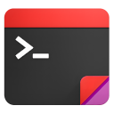
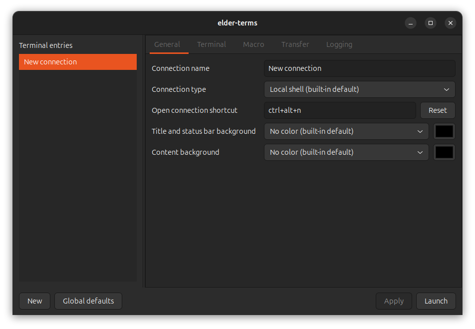
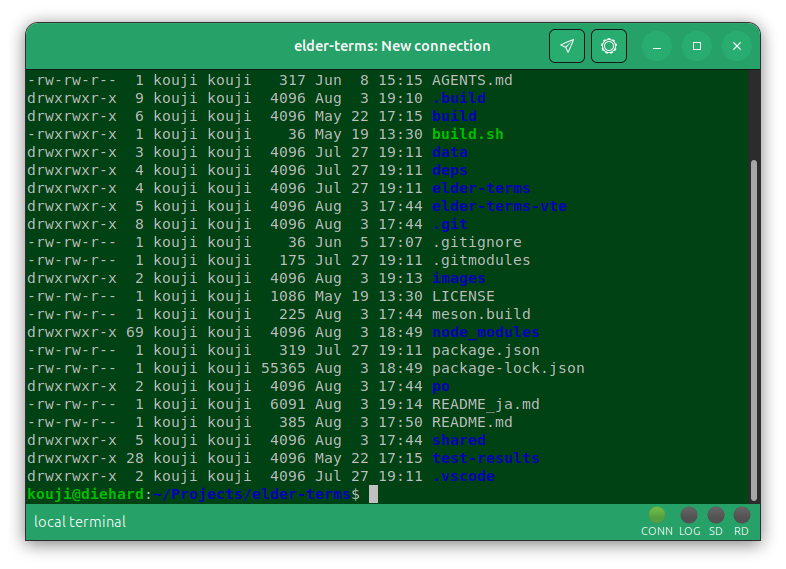

# elder-terms

'90s、あの頃のパラダイス



[](https://www.repostatus.org/#active)
[](https://opensource.org/licenses/MIT)

---

[(English language is here)](./README.md)

## これは何?

シリアル接続やTELNET、そしてパソコン通信。すべてが懐かしく、すべてが満たされ、そして全てがコントローラブルだったあの頃。
現代的な機能も追加して、蘇るターミナル生活。





## 機能

- Linux GTK/`libvte` を使用して、飾らない、必要十分なターミナルを実現します。
- シリアルやTELNET接続だけではなく、ローカルターミナル、SSH、SFTPもサポートし、現代で同じ生活を取り戻せます。
- インジケータがターミナルの下部に表示されます。アナログモデムを思い出して、余韻に浸れます。
- ランチャーから複数の接続先を管理したり、そこからターミナルの起動を行えます。
- 接続先の設定は、全てINI形式のファイルに保存されます。
  INI形式なので、自由にエディタで再編集出来ます。
- BS/DEL、カーソルキー変換、文字コード変換を指定できます。
- ターミナルの行数と桁数を、接続毎の設定として記憶出来ます。
- TELNET/SSHで、ターミナル種別 (`xterm`や`xterm-256color`など) を明示的に指定できます。
- X/Y/ZMODEMファイル送受信をサポートしています（ローカルターミナルを除く）。
  ZMODEMなら、自動送受信を有効化出来ます。
- SFTPで、SSH接続を行うホストとファイルの送受信を実行出来ます。
- テキストのペーストやテキストファイルの送信を実行出来ます。
  その際に、送信速度を指定して、ホスト側のバッファオーバーフローを回避出来ます。
- フォントサイズをショートカットキーで変更したり、マウスのホイールで変更したり出来ます。
- 接続毎にウインドウのエクステリアカラーやターミナルの背景色をカスタマイズ出来ます。
- ホットキー一発で、指定された接続を起動出来ます。
  まずは、ローカルターミナルをホットキーで起動できるようにすることから始めて下さい。
  全てがelder-termsに置き換わるのも、時間の問題でしょう。
- ランチャーを自動起動させたり、システムトレイに常駐させることが出来ます。
- 受信文字列を正規表現で監視して、自動的に文字列を送信したり、指定されたコマンドを実行できるルールを指定出来ます。
- ログをファイルに記録できます。接続先や日時によるディレクトリの分離によって、ログの整理が捗ります。
- 多国語表示に対応しています (ar, en, es, fr, hi, ja, ko, pt, ru, zh)

## 環境

- Linux GTK3 / DBus (Ubuntu/Debian preferred)

---

## インストール

[リリースリポジトリ](https://github.com/kekyo/elder-terms/releases/) から、プリビルドされたパッケージ (deb形式) をダウンロードして、インストールして下さい:

```bash
sudo apt install ./elder-terms-*.deb
```

その後、elder-termsを起動して下さい:

```bash
elder-terms
```

---

## 使い方

まずは、ローカルターミナルの接続エントリを作りましょう。
これは、`bash` などのシェルを起動するターミナル、つまり普段あなたが目にしているターミナルとほぼ同じものです。
起動すれば、あなたのユーザーに紐付けられているシェルが起動します。

作り方は簡単です。ランチャー下部の "New" ボタンをクリックして、名前を "New connection" から適当な名前に変更して、 "Save" をクリックするだけです。これで、ローカルターミナルが起動するエントリが出来ました。
あとは、ランチャーのリストに表示されているエントリをダブルクリックすれば起動できます。ほら:

ここで、ターミナル上部のギアアイコンをクリックすると、このターミナルの様々な設定を変更することが出来ます。
"Apply" ボタンをクリックすれば、今起動しているターミナルにのみ、変更が適用されます。
"Save" ボタンをクリックすると、その設定を記憶するので、次回ターミナル起動時に反映されるようになります。

"Apply" ボタンを使って、色々な設定を変更してみると良いでしょう。
失敗しても、ターミナルウインドウを閉じれば捨てることが出来ます。

大半は、触ってみればわかる設定項目ですが、いくつかは説明が必要でしょう。

---

## 設定項目の構造

elder-termsの設定値には、次の三種類があります。後に挙げる設定ほど優先されます。

1. **組み込み既定値**: elder-terms自体が持つ既定値です。接続種別などに応じて決まります。
2. **INIファイルに保存された設定**: 「グローバル既定値」の `global.ini` が組み込み既定値を上書きし、各接続のINIファイルが更にそれを上書きします。次回の起動にも引き継がれます。
3. **起動セッションの設定**: ランチャーで保存していない変更を使って接続を起動した場合、その変更は一時的な起動用プロファイルとして接続先のウインドウへ渡されます。また、起動後の設定ダイアログで「適用」した変更も、現在のセッションだけに反映されます。これらは「保存」しない限りINIファイルへ記録されず、セッションの終了時に失われます。

設定ダイアログでは、継承している値に `（組み込み既定値）` または `（グローバル既定値）` と出所が表示されます。テキスト入力欄では既定値が薄いプレースホルダーとして表示され、選択欄では既定値の選択肢に出所が併記されます。
括弧内の出所が付かない通常の値は、接続のINIファイルまたは現在の起動セッションで明示的に指定された値です。両者は値の表示だけでは区別されません。「保存」は明示値を接続のINIファイルへ記録し、「適用」は現在のセッションだけに反映します。
テキスト入力欄を空に戻すか、選択欄で既定値の項目を選ぶと、その項目の明示的な指定が削除され、グローバル既定値または組み込み既定値を再び継承します。

## シリアルデバイスの選択

シリアル接続の「デバイス識別方式」で、次の3種類からデバイスを識別する方法を選択出来ます。

- **安定デバイスID**: `/dev/serial/by-id` に作られるリンクを使用します。同じUSBシリアルデバイスを別のUSBポートへ挿し替えても追跡できるため、通常は組み込み既定値のこの方式を使用して下さい。
- **物理USBポート**: `/dev/serial/by-path` に作られるリンクを使用します。USBシリアルデバイス個体ではなく、常に同じ物理ポートに挿されたデバイスへ接続したい場合に使用します。
- **デバイスパス**: `/dev/ttyUSB0` や `/dev/ttyACM0` などの現在のデバイスノードを使用します。抜き挿しの後にノード番号が変わる可能性があります。

「デバイス」はパスの直接入力欄ではなく、選択した識別方式で現在利用出来るデバイスの一覧です。一覧は抜き挿しを検知して自動的に更新されます。選択中のデバイスについて、「安定ID」「USBシリアル番号」「現在のデバイスノード」も表示されます。

接続中にデバイスが外れた場合は選択した識別情報を保持し、同じ対象が再び現れたときに再接続します。「安定デバイスID」ではUSBシリアル番号も補助的に記憶するため、`/dev/serial/by-id` のリンク名が変わっても、一意に一台を特定出来る場合は同じデバイスへ再接続します。同じUSBシリアル番号の候補が複数ある場合は、誤ったデバイスを選ばず接続を待機します。

INIファイルでは次のように保存されます。`device_match_mode` は `path`、`by-id`、`by-path` のいずれかで、省略時は `by-id` です。`device_usb_serial` は設定画面が取得出来た場合に保存される補助情報です。

```ini
[serial]
device_match_mode=by-id
device=/dev/serial/by-id/usb-Example_Serial_Device_1234-if00
device_usb_serial=1234
```

`device_match_mode` が無い従来のINIファイルに `/dev/ttyUSB0` などの `device` が保存されている場合も、そのパスは引き続き使用されます。設定画面で選び直す場合は、用途に合わせて上記の識別方式を選択して下さい。

## シリアル接続の監視

「接続監視信号」では、DCD、CTS、DSRのいずれかがHighからLowへ変化したときにセッションの切断を検出します。USBシリアルアダプタが利用可能なモデムライン信号を持たない場合や、ドライバがモデムラインのpollに対応せず「無効な引数です」と報告する場合は、「監視しない」を選択して下さい。

「監視しない」ではモデムラインの状態を取得せず、その状態によって「セッション終了時にウインドウを閉じる」が実行されることもありません。シリアルセッションは送受信可能な状態として維持されます。ただし、デバイス自体の取り外しやread/writeエラーは、従来どおり実際の切断として扱います。

INIファイルでは次のように保存されます。

```ini
[serial]
carrier_detect=ignore
```

## 文字コードの設定

「文字エンコーディング」は、接続先から受信したバイト列を画面表示用のUTF-8へ変換し、入力した文字列を接続先の文字コードへ変換するために使用されます。デフォルトはすべての接続で `UTF-8` です。

「Backspaceコード」は、Backspaceキーを押したときに送信する制御コードを選択します。「BS」はASCII BS（`0x08`）、「DEL」はASCII DEL（`0x7f`）を送信します。接続先でBackspaceキーを押しても文字が消えない場合や、`^H` などが表示される場合は、この設定を切り替えて下さい。Deleteキーはこの設定にかかわらずDELを送信します。

「カーソルキーモード」の「通常」は、`libvte` が生成した通常のエスケープシーケンスをそのまま送信します。
「ADM」は、 ([ADM-3A](https://www.bitsavers.org/pdf/learSiegler/ADM_3/ADM3A_Maint.pdf) 互換端末やホスト (主にRLogin由来と思われる) で使用される一バイトの制御コードへ変換し、上を `0x1e`、下を `0x1f`、右を `0x1c`、左を `0x1d` として送信します。接続先が ADM-3A 系のカーソルキーを要求する場合に使用して下さい。

接続種別ごとの組み込み既定値は次の通りです。

| 接続種別 | 文字エンコーディング | Backspaceコード | カーソルキーモード |
| --- | --- | --- | --- |
| ローカルターミナル | UTF-8 | DEL | 通常 |
| TELNET | UTF-8 | BS | 通常 |
| シリアル | UTF-8 | BS | ADM3 |
| SSH | UTF-8 | DEL | 通常 |

### 文字コードの補足

文字コードは iconv の定義名を受け入れますが、文字コード名には似て異なる定義がいくつか存在することに注意してください。

例えば、日本語圏において、BBSシリアル通信でよく使われる「シフトJIS」は、iconv の定義名で `shift_jis` というわかりやすい対応名がありますが、実際には慣例的に NEC PC-9800 シリーズで使われている、拡張された `cp932` がベターです。

異なる文字コードを使用した場合、拡張されたり変更されている文字を受信すると、文字化けの原因となります。

## ホットキーの設定

ホットキーは、elder-termsのランチャーが起動している間だけ機能します。
システムトレイに対応した環境では、ランチャーの「グローバル既定値」で「起動モード」を「システムトレイのみ」または「システムトレイとメインウィンドウ」に設定すると、ランチャーをシステムトレイに常駐させられます。
ログイン直後からホットキーを使いたい場合は、デスクトップ環境の自動起動アプリケーションに `elder-terms` を登録して下さい。

各接続の「接続を開くショートカット」にキーの組み合わせを設定すると、ランチャーが非表示でも、そのホットキーで接続を直接起動出来ます。
「グローバル既定値」の「アプリケーションを開くショートカット」はランチャーを表示するためのホットキーで、デフォルトは `Ctrl+Alt+T` です。

Waylandセッションでは、ホットキーの登録にデスクトップ環境のGlobal Shortcutsポータルが必要です。
[GNOME 48からGlobal Shortcutsが正式にサポートされた](https://release.gnome.org/48/developers/#global-shortcuts)ため、GNOME 47以前のWaylandセッションではホットキーは機能しません。
標準のGNOMEデスクトップを使用するディストリビューションでは、GNOME 48を採用した[Ubuntu 25.04](https://discourse.ubuntu.com/t/ubuntu-25-04-plucky-puffin-released/59303)および[Debian 13](https://www.debian.org/News/2025/20250809)以降が対応します。
つまり、Ubuntu 24.10以前またはDebian 12以前のGNOME Wayland環境では利用出来ません。
X11セッションはこの制限の対象外です。また、GNOME以外のWayland環境で利用出来るかどうかは、そのデスクトップ環境がGlobal Shortcutsポータルに対応しているかどうかによります。

## ターミナル種別の設定

ターミナル種別は、接続先にelder-termsがエミュレートする端末の種類を伝えるための名前です。
TELNETではターミナル種別のネゴシエーション時に、SSHでは仮想端末の確保時に、この値が接続先へ自動的に通知されます。
接続先のシェルや `curses` などのアプリケーションは、この値に対応する `terminfo` を参照して、色、カーソル移動、ファンクションキーなどの制御シーケンスを選択します。
通常はデフォルトのままで構いませんが、接続先がそのターミナル種別に対応していない場合は、接続先にインストールされている `xterm` などの値を指定して下さい。

TELNETとSSHの通常のデフォルトは `xterm-256color` です。
ただし、「コンテンツの背景」に色を指定し、ターミナル種別を明示的に指定していない場合は、`libvte` で指定した背景色を正しく扱うため、デフォルトが自動的に `xterm` に変わります。
ターミナル種別を明示的に指定した場合は、背景色を変更してもその値が優先されます。

## 表示言語の設定

「グローバル既定値」の「表示言語」では、システムの既定言語、英語、アラビア語、スペイン語、フランス語、ヒンディー語、日本語、韓国語、ポルトガル語、ロシア語、簡体字中国語を選択出来ます。

表示言語はelder-termsの起動時に読み込まれるため、変更を保存した後にelder-termsを再起動する必要があります。
保存時に表示されるダイアログで「今すぐ再起動」を選ぶか、後で手動で再起動して下さい。
既に開いているターミナルやSFTPのウインドウも、その場では表示言語が切り替わりません。

## ログの設定

「ログを有効にする」を有効にすると、接続先から受信した内容がファイルに記録されます。
「ログディレクトリ」は保存先の基準となるディレクトリで、デフォルトは `{documents}/logs/` です。
「ファイル名形式」はそのディレクトリからの相対パスで、デフォルトは `{YYYYMMDD}_{hhmmss}_{fff}.txt` です。

どちらの項目でも、次のプレースホルダーを使用出来ます。

- `{documents}`、`{downloads}`、`{home}`: それぞれユーザーのドキュメント、ダウンロード、ホームディレクトリ
- `{name}`: 接続名
- `YYYY`、`MM`、`DD`: ログの記録を開始したローカル時刻の年、月、日
- `hh`、`mm`、`ss`、`fff`: 同じ時刻の時、分、秒、ミリ秒

日時の要素は、`{YYYYMMDD}` や `{YYYY-MM-DD}` のように一組の波括弧内で組み合わせることも出来ます。
「ファイル名形式」には `/` を含められ、必要なディレクトリは自動的に作成されます。
例えば、ログディレクトリを `{documents}/elder-terms`、ファイル名形式を `{name}/{YYYY}/{MM}/{YYYYMMDD}_{hhmmss}.txt` とすれば、接続先、年、月ごとにログを分割出来ます。

「ログ内容」で、保存形式と文字コードを選択します。
「生バイト列（文字変換前）」は接続先から受信したバイトを変換せずに保存するため、接続に設定した文字コードのまま記録されます。
「UTF-8テキスト（文字変換後）」は画面表示用に文字コードを変換した後のテキストをUTF-8で保存します。

## マクロの設定

マクロ（オートマクロ）は、接続先から受信した文字列を正規表現で監視し、一致したときに文字列を接続先へ送信するか、指定したコマンドを実行する機能です。
ローカルターミナル、TELNET、シリアル、SSHの各接続で使用出来ますが、SFTP接続やグローバル既定値には定義出来ません。

送信文字列、コマンド、コマンド引数では、正規表現に一致した全体を `${0}`、番号付きキャプチャを `${1}`、`${2}`、名前付きキャプチャを `${name}` の形式で参照出来ます。
リテラルの `$` は `$$` と記述します。

マクロルールは一覧の上から順に評価され、同じ受信行に複数の正規表現が一致しても、最初に一致したルールだけが実行されます。
「上へ移動」と「下へ移動」で、より優先したいルールを上に配置して下さい。
INIファイルを直接編集する場合は、`[macro.<ルールID>]` セクションを記述した順序が優先順位になります。

次の例は接続のINIファイルへ直接記述する形式ですが、設定ダイアログの「マクロ」タブでも同じ内容を設定出来ます。

接続先に `Press ENTER to continue` と表示されたら、Enterを自動送信します。

```ini
[macro.continue]
regex=^Press ENTER to continue$
send=\r\n
```

`CHALLENGE TOKEN` のような文字列からトークンを取り出し、`RESPONSE TOKEN` と改行を返信します。

```ini
[macro.challenge]
regex=^CHALLENGE (?<token>[A-Z]+)$
send=RESPONSE ${token}\r\n
```

`ERROR: 接続に失敗しました` のような行を受信したら、メッセージ部分を `logger` コマンドへ渡してシステムログへ記録します。`arguments` はセミコロン区切りで、一つずつ独立したコマンド引数になります。

```ini
[macro.log-error]
regex=^ERROR: (.+)$
command=/usr/bin/logger
arguments=-t;elder-terms;${1};
```

コマンドはシェルを介さず直接起動されるため、パイプやリダイレクトなどのシェル構文は解釈されません。必要な値は `arguments` に一引数ずつ指定して下さい。

## INIファイルの保存位置

設定ファイルは、XDGのユーザー設定ディレクトリ以下に保存されます。
`XDG_CONFIG_HOME` が設定されていない通常の環境では、保存位置は次の通りです。

- グローバル既定値: `~/.config/elder-terms/global.ini`
- 接続設定: `~/.config/elder-terms/connections/<接続名>.ini`

`XDG_CONFIG_HOME` が設定されている場合は、上記の `~/.config` がその値に置き換わります。
接続設定ではグローバル既定値を継承し、接続ごとに変更した値がグローバル既定値より優先されます。

---

## セルフビルド

UbuntuまたはDebianでビルドする場合は、C++20対応コンパイラ、Meson、Ninja、gettextと、使用するライブラリの開発パッケージをインストールします。

```bash
sudo apt update
sudo apt install build-essential git meson ninja-build pkg-config gettext \
  libglib2.0-dev libgtk-3-dev libgdk-pixbuf-2.0-dev libx11-dev \
  libxkbcommon-dev liburing-dev libudev-dev libssh-dev libvte-2.91-dev
```

このほか、  Node.js 20以降が必要です。ディストリビューションが配布する Node.jsが使えるかもしれません:

```bash
sudo apt install nodejs
node --version
```

あるいは、ディストリビューション付属の Node.js が古い場合は、 [Node.js の公式配布物](https://nodejs.org/ja/download) や任意のバージョン管理ツール（例えば [nvm](https://github.com/nvm-sh/nvm)）を使用して下さい。

> GTKプロジェクトでNode.jsを使用するのを、奇妙に感じるかもしれません。
> これはGTK UIのテストに [gestament](https://github.com/kekyo/gestament/) を使用するからです。

新しくソースコードを取得する場合は、依存する [cardio](https://github.com/kekyo/cardio/) と [libxyzm](https://github.com/kekyo/libxyzm/) も取得するため、サブモジュールを含めてcloneします。

```bash
git clone --recurse-submodules https://github.com/kekyo/elder-terms.git
```

既にclone済みの場合は、次のコマンドでサブモジュールを初期化・更新出来ます。

```bash
git submodule update --init --recursive
```

npm依存パッケージを取得して、全ワークスペースをビルドします。

```bash
npm ci
npm run build
```

ビルドしたランチャーは、リポジトリのルートから次のコマンドで起動出来ます。ランチャーは同じビルドディレクトリにあるターミナルとSFTPの実行ファイルを自動的に検出します。

```bash
./.build/elder-terms/elder-terms
```

あるいは:

```bash
npm run dev
```

テストを実行する場合は（UIテストを含むため、非常に時間がかかります）:

```bash
npm run test
```

## License

Under MIT.
